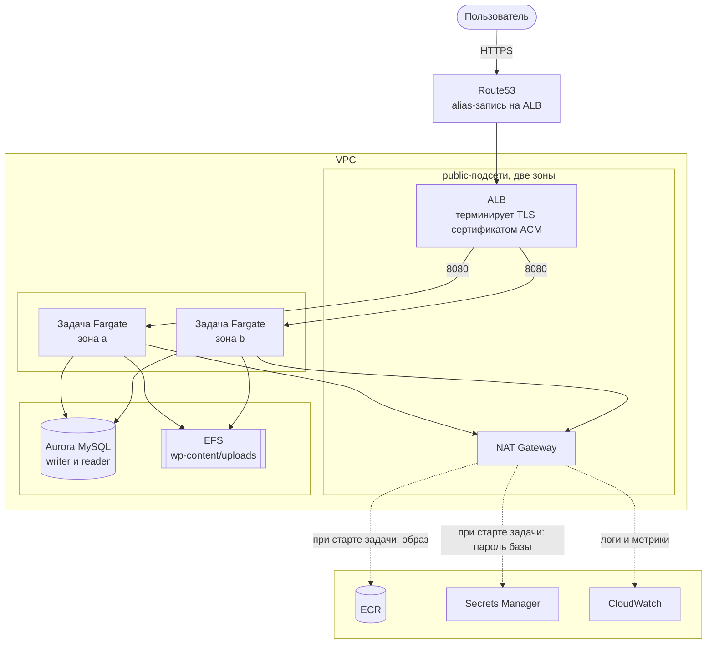

# wp-infra

Terraform для инфраструктуры AWS под [wp-app](https://github.com/nirvandgupshob/wp-app): WordPress на ECS Fargate в двух окружениях.

| Окружение | Адрес | Ключ state |
|---|---|---|
| staging | https://staging.wp-demo-bogdan.click | `staging/terraform.tfstate` |
| production | https://wp-demo-bogdan.click | `production/terraform.tfstate` |

Локальное окружение живёт в `wp-app` и поднимается через `make up`.

## Путь запроса



1. Браузер резолвит `wp-demo-bogdan.click`. Route53 отдаёт alias на балансировщик, у которого есть узел в каждой зоне доступности.
2. TLS терминируется на ALB сертификатом ACM. Запрос, пришедший на порт 80, получает 301 на 443.
3. ALB выбирает здоровую цель. Здоровье определяется по `/healthz.php` — эта проба не обращается к базе, чтобы просадка Aurora не выбила из ротации сразу все задачи.
4. До задачи запрос идёт обычным HTTP на порт 8080 внутри VPC. Security group задач принимает только группу балансировщика, иначе до контейнера не достучаться.
5. Apache передаёт запрос PHP. WordPress читает `X-Forwarded-Proto` и генерирует https-ссылки, хотя сам получил запрос по http.
6. За данными WordPress идёт в Aurora на 3306 по TLS, за загруженными файлами — в EFS на 2049. У обеих подсетей нет маршрута по умолчанию, наружу оттуда хода нет.
7. Ответ возвращается тем же путём.

## Структура

```
bootstrap/    бакет state, ключ KMS, ECR, роли GitHub OIDC, CloudTrail — применяется руками
modules/      network, dns, database, storage, service, observability
envs/         staging и production, каждое — тонкая сборка из модулей
scripts/      verify.sh, drill.sh, maintenance-task.sh
docs/         архитектура, безопасность
```

В `bootstrap` лежит то, что переживает окружение: бакет со state, реестр образов, журнал CloudTrail. `terraform destroy` окружения их не трогает. Зона Route53 не управляется Terraform вовсе — она создана руками и подключается data-источником, потому что при пересоздании получает новые nameservers. Подробнее — [bootstrap/README.md](bootstrap/README.md).

Окружения — отдельные директории, а не workspaces: разные state, разные backend, разные роли IAM. Отличия между ними — в `envs/*/variables.tf`.

## Требования

`terraform` 1.15, `awscli` v2, `jq`, `docker` (для линтеров) и доступ к аккаунту.

## Команды

```bash
make help
```

| Команда | Что делает |
|---|---|
| `make plan ENV=staging` | показать, что изменится |
| `make apply ENV=staging` | применить окружение |
| `make verify ENV=staging` | проверить, что окружение здорово |
| `make drill SCENARIO=failover ENV=staging` | прогнать сценарий отказа |
| `make lint` | `fmt -check`, `validate`, `tflint`, `shellcheck` |
| `make maintenance ENV=staging CMD='wp core version'` | разовая команда wp-cli в кластере |

`ENV` по умолчанию `staging`.

## Проверка окружения

Скрипт `scripts/verify.sh` проверяет редирект и сертификат, пять HTTP-эндпоинтов, доступность базы из приложения, здоровье задач и их распределение по зонам, running против desired, нездоровые цели балансировщика, статус и публичность базы, все алармы и чистоту `terraform plan`.

```bash
make verify ENV=production
```


## Сценарии отказа

Cкрипт `scripts/drill.sh` воспроизводит отказы и измеряет результат.

| Сценарий | Что делает |
|---|---|
| `failover` | останавливает задачу и считает коды ответов, пока ECS её заменяет |
| `autoscale` | даёт нагрузку, следит за расширением и последующим сжатием |
| `rollback` | выкатывает ревизию, которая не отвечает, и ждёт отката circuit breaker |
| `restore` | снапшот, восстановление во временный кластер, сверка числа записей, уборка |

```bash
make drill SCENARIO=rollback ENV=staging
```

## Пайплайн

`.github/workflows/terraform.yml`:

| Триггер | Что происходит |
|---|---|
| pull request | `fmt -check`, `validate`, `tflint`, затем `plan` обоих окружений комментарием в PR |
| push в `main` | `apply` для staging |
| ручной запуск | `apply` для production за подтверждением в GitHub Environment |

Аутентификация — GitHub OIDC, статических ключей AWS в GitHub нет. У роли для `plan` — `ReadOnlyAccess`, у ролей для `apply` — `PowerUserAccess` плюс права IAM в пределах ролей `wp-*`. Подробности в [docs/SECURITY.md](docs/SECURITY.md).

## Откат

| Что сломалось | Что делать |
|---|---|
| Новая ревизия не проходит health check | ничего: circuit breaker ECS сам возвращает предыдущую |
| Плохая версия приложения уже работает | workflow `rollback` в `wp-app` с тегом или дайджестом |
| Плохое изменение инфраструктуры | `git revert` и повторный `apply` |
| Потеря данных | снапшот или point-in-time recovery: окно сутки в staging, 30 дней в production |


## Уборка

Защита от удаления в production блокирует `terraform destroy`, поэтому сначала её надо снять:

```bash
terraform -chdir=envs/production apply -var 'deletion_protection=false'
make destroy ENV=production
make destroy ENV=staging
```

Содержимое `bootstrap` при этом остаётся.

## Документация

- [Архитектура](docs/ARCHITECTURE.md) — схема, путь трафика, поведение при отказе зоны
- [Безопасность](docs/SECURITY.md) — доступ, секреты, сеть, осознанные ограничения
- [bootstrap](bootstrap/README.md) — общие ресурсы и развёртывание с нуля
